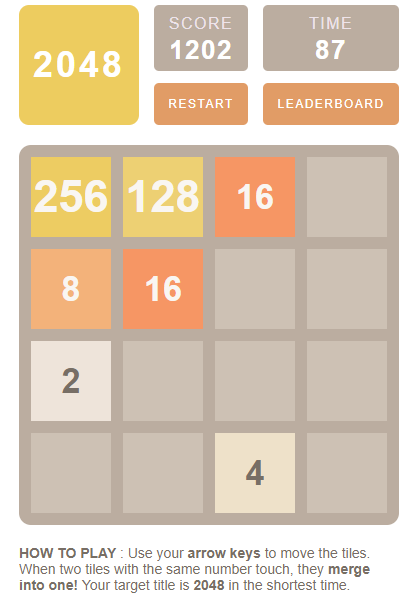

## Preview

2048 is a single-player sliding block puzzle game. When two tiles with the same number touch, they merge into one! You will win when you get 2048 title.  
Deployed: [https://game2048-huyen.web.app/](https://game2048-huyen.web.app/)  
<p align="center">

</p>

## Technologies
* react: 16.13.1,
* react-dom: 16.13.1,
* react-scripts: 3.4.3
* axios: 0.20.0,
* prop-types: 15.7.2,
* classnames: 2.2.6,
* aphrodite: 2.4.0,
* react-animations: 1.0.0,

## Setup
To run this project, install it locally using npm:
```
$ npm start
```
To build for production:
```
$ npm run build
```
